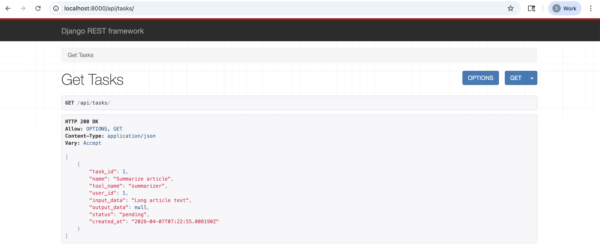
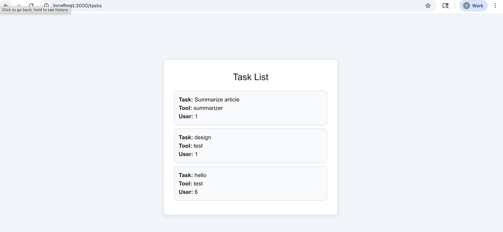
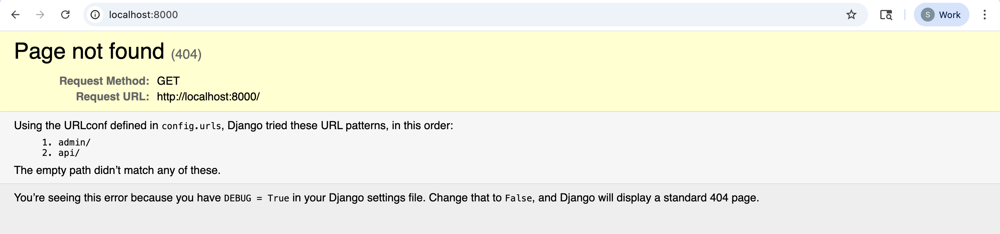
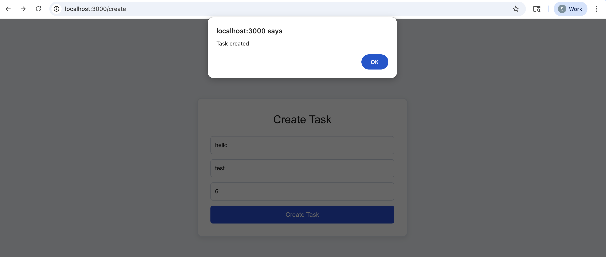
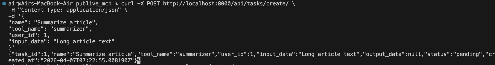

Here is **everything in one clean `README.md` (Markdown) with image links included**. You can paste this directly into your repo.

```md
# Publive MCP

Simple full-stack task app using **Django + PostgreSQL + Next.js + Docker**

---

## Architecture

```

Next.js (Frontend :3000)
↓
Django API (Backend :8000)
↓
PostgreSQL Database

```

Frontend calls Django APIs → Django stores/fetches data from PostgreSQL → Response returned to frontend.

---

## Project Structure

```

publive_mcp
│
├── api/                 # Django app (task API)
├── config/              # Django settings
├── frontend/            # Next.js app
│
├── Images/              # Screenshots
│   ├── get_tasks_localhost_8000.png
│   ├── get_tasks_next.png
│   ├── localhost_8000.png
│   ├── post_next_output.png
│   └── post_terminal_output.png
│
├── docker-compose.yml
├── Dockerfile
├── requirements.txt
└── manage.py

````

---

## Run Backend (Django + PostgreSQL)

From project root:

```bash
docker compose up --build
````

Backend runs at:

```
http://localhost:8000
```

Test API:

```bash
curl http://localhost:8000/api/tasks/
```

---

## Run Frontend (Next.js)

Open new terminal:

```bash
cd frontend
npm install
npm run dev
```

Frontend runs at:

```
http://localhost:3000
```

---

## API Endpoints

```
GET   /api/tasks/          -> get all tasks
POST  /api/tasks/create/   -> create new task
```

---

# Screenshots

## Django API Output



---

## Tasks fetched in Next.js



---

## Django running on localhost:8000



---

## Create task from Next.js



---

## Create task using terminal



---

## Useful Commands

Start containers

```bash
docker compose up
```

Stop containers

```bash
docker compose down
```

Run migrations

```bash
docker compose exec web python manage.py migrate
```

Open Django shell

```bash
docker compose exec web python manage.py shell
```

---

## Data Flow

```
User
  ↓
Next.js Frontend
  ↓
Django REST API
  ↓
PostgreSQL Database
```


